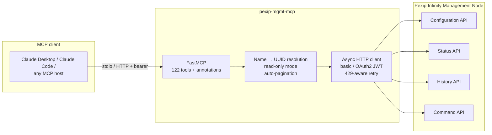

# MCP Server for Pexip Infinity

[](https://github.com/Josh-E-S/pexip-mgmt-mcp/actions/workflows/ci.yml)
[](LICENSE)
[](https://www.python.org/downloads/)
[](https://github.com/astral-sh/ruff)

<!-- mcp-name: io.github.josh-e-s/pexip-mgmt-mcp -->

MCP (Model Context Protocol) server for the **Pexip Infinity Management API**.
Lets a Claude / LLM-based agent read and operate a Pexip Infinity deployment
through **122 curated tools** covering all four admin API categories —
Configuration, Status, History, and Command.

> **Disclaimer:** This is an independent, community-built project. It is **not
> affiliated with, endorsed by, or sponsored by Pexip**. "Pexip" and "Pexip
> Infinity" are trademarks of their respective owners; this tool simply uses
> Pexip's public Management API. It sends **no telemetry or analytics**, and it
> connects only to the Pexip Management Node you configure (plus your own
> identity provider when you use OIDC). It never sends your data anywhere else.

Ask in plain English; the server does the plumbing:

- _"Alice's standup is going long — kick the late joiners and lock the
  meeting"_ → `list_active_participants` → `disconnect_participant("Bob")` →
  `lock_conference("standup")`
- _"Is Bob's call OK right now?"_ → `get_participant_quality("Bob")` — one call,
  the server resolves the name
- _"Total calls today, broken out by direction and quality"_ →
  `summarize_calls` (server-side aggregation, no CDR dump into context)
- _"Add `meet.alice@example.com` as an alias on the AllHands VMR"_ →
  `add_vmr_alias`

**Why 122 tools and not 400?** A naive wrapper of this API surface produces
400+ tools, which bloats every LLM request and drowns the model in choices.
High-traffic resources (VMRs, users, devices, rules…) get dedicated typed
tools; the ~70 remaining configuration resources are served by five generic
CRUD tools backed by a resource registry. Same coverage, a fraction of the
tokens, and measurably better tool selection — verified by the
[eval suite](#quality-the-eval-suite).

## Contents

- [Coverage](#coverage)
- [How it fits together](#how-it-fits-together)
- [Install](#install)
- [Quick start](#quick-start)
- [Configuration](#configuration)
- [Design notes](#design-notes)
- [Quality: the eval suite](#quality-the-eval-suite)
- [Skills SDK](#skills-sdk)
- [Testing](#testing)

## Coverage

| API | Tools | What it covers |
|---|---|---|
| **Configuration** | 46 | VMRs + aliases, end users, devices, gateway rules, automatic participants, IVR themes, LDAP sync, locations + Conferencing Nodes, global settings, schema introspection — plus **generic CRUD** (`list/get/create/update/delete_resource`) over ~70 registry resources: SIP/H.323/MS-SIP proxies, TURN/STUN, Teams Connectors, Azure tenants, Google Meet tokens, MJX (endpoints, integrations, deployments), DNS/NTP/SMTP/syslog/SNMP, certificates (CA/TLS/CSR), admin roles + identity providers, backups + upgrades, web app hosting, policy profiles, and more |
| **Status** | 39 | Live conferences + per-node shards, participants + media streams, per-participant call quality, registrations, node/location status + load stats, backplanes, alarms, licensing, cloud overflow, Exchange scheduler, MJX endpoints + meetings, Teams Connector nodes + calls |
| **History** | 14 | Conference + participant CDRs, server-side aggregation (`summarize_calls`), alarm history, backplane history, registration history, node event history |
| **Command** | 23 | Active call control: dial, disconnect, mute/unmute (participant or all guests), set role, lock/unlock, transfer, layout, messages, LDAP sync, provisioning emails, backup create/restore, certificate import, snapshot, upgrade |

The full catalog with per-tool annotations and parameters is in
[TOOLS.md](TOOLS.md) (regenerate with `uv run python scripts/generate_tools_md.py`).

### Deliberately not exposed

DTMF injection (`participant/dtmf`) and text overlay
(`participant/set_text_overlay`) are not wrapped — they inject content into
live call media streams.

## How it fits together



Source layout:

```
src/pexip_mcp/
├── client.py                 # Async PexipClient (all 4 API categories), 429-aware retry
├── config.py                 # PexipSettings (env-driven, pydantic-settings)
├── mcp_app.py                # FastMCP instance + lifespan
├── server.py                 # Imports tool modules to trigger registration
├── __main__.py               # Entry point + --healthcheck + --http
└── tools/
    ├── _helpers.py           # get_client, resolve_id_by_field, paginate_all, annotation presets
    ├── command.py            # Active call control + name→UUID resolvers
    ├── status.py             # Live state + per-participant quality
    ├── history.py            # CDRs + summarize_calls aggregation
    ├── resource_crud.py      # Generic CRUD + resource registry (~70 resources)
    ├── schema.py             # Live schema introspection
    └── conference.py, end_user.py, device.py, gateway_rule.py, alias.py,
        automatic_participant.py, infrastructure.py, ldap.py,
        ivr_theme.py, global_settings.py   # dedicated typed CRUD per resource
```

## Install

> **Status:** packaging is wired up but **nothing is published yet** — publish is
> deliberately gated on tagging a release after real-node testing. The commands
> below are the intended install paths; until then, use the from-source
> [Quick start](#quick-start).

- **`uvx` (Python, zero-clone)** — once on PyPI:
  ```bash
  uvx pexip-mgmt-mcp --healthcheck
  ```
- **Claude Desktop (one-click bundle)** — the friendliest path for non-developers:
  build a `.mcpb` and double-click to install; a form collects host + credentials
  (no JSON, no terminal). Unlike the published channels, this **works today**:
  ```bash
  npm install -g @anthropic-ai/mcpb   # one-time
  ./packaging/mcpb/build.sh           # → packaging/mcpb/pexip-mgmt-mcp.mcpb
  ```
  See [packaging/mcpb/](packaging/mcpb/). Platform-specific — build on the OS you'll install on.
- **Docker (self-hosted HTTP transport)** — run alongside your Infinity:
  ```bash
  cp .env.example .env   # fill in PEXIP_* incl. PEXIP_MCP_TOKEN
  docker compose up -d   # serves 127.0.0.1:8000; front it with a tunnel/proxy
  ```
  See [DEPLOY.md](DEPLOY.md) for the Cloudflare Tunnel + Access posture.
Distribution channels (PyPI + the GHCR image via the `docker` workflow) are
**tag-gated** — see `.github/workflows/`. The Claude Desktop bundle
([packaging/mcpb/](packaging/mcpb/)) builds locally today. Marketplace listings
(official MCP Registry, Docker MCP Catalog) are staged in `server.json` and `packaging/`.

## Quick start

```bash
git clone https://github.com/Josh-E-S/pexip-mgmt-mcp.git
cd pexip-mgmt-mcp
uv sync
cp .env.example .env
# edit .env with your Pexip Management Node credentials

uv run python -m pexip_mcp --healthcheck
# OK: connected to manager.example.com as admin, schema fetched
```

### Wire into Claude Desktop / Claude Code

```json
{
  "mcpServers": {
    "pexip-mgmt": {
      "command": "uv",
      "args": [
        "--directory", "/absolute/path/to/pexip-mgmt-mcp",
        "run", "python", "-m", "pexip_mcp"
      ],
      "env": {
        "PEXIP_HOST": "manager.example.com",
        "PEXIP_USERNAME": "admin",
        "PEXIP_PASSWORD": "..."
      }
    }
  }
}
```

## Configuration

All env vars are `PEXIP_*` prefixed and loaded from `.env` (or the process
environment).

| Variable | Default | Purpose |
|---|---|---|
| `PEXIP_HOST` | required | Management Node hostname or IP, no scheme |
| `PEXIP_AUTH_MODE` | `basic` | `basic` (local admin user/pass) or `oauth2` |
| `PEXIP_USERNAME` | basic only | Admin username (typically `admin`) |
| `PEXIP_PASSWORD` | basic only | Admin password |
| `PEXIP_OAUTH2_CLIENT_ID` | oauth2 only | OAuth2 Client ID from the Pexip UI |
| `PEXIP_OAUTH2_PRIVATE_KEY` | oauth2 only | OAuth2 client "Private key" (ES256, shown once) |
| `PEXIP_OAUTH2_TOKEN_URL` | `https://<host>/oauth/token/` | Override the token endpoint |
| `PEXIP_OAUTH2_SCOPE` | `is_admin use_api` | OAuth2 scopes requested |
| `PEXIP_VERIFY_TLS` | `true` | Set `false` for self-signed lab nodes |
| `PEXIP_TIMEOUT` | `30` | HTTP timeout in seconds |
| `PEXIP_MAX_RETRIES` | `3` | Retries on 429 rate-limit responses |
| `PEXIP_READ_ONLY` | `true` | Expose only read tools; remove all write/control tools. **On by default** — set `false` to enable writes |
| `PEXIP_ALLOW_SECURITY_RESOURCES` | `false` | Allow generic CRUD to mutate security-critical resources (SSH keys, roles, auth, certs). Only relevant when writes are enabled |
| `PEXIP_ALLOW_PLATFORM_TOOLS` | `false` | Expose platform-lifecycle command tools (backup/restore, upgrade, cert import, software upload, cloud-node start, snapshot). Removed at startup unless enabled, even with writes on |
| `PEXIP_MCP_AUTH_MODE` | `token` | How HTTP clients authenticate to this server: `token` (static bearer) or `oauth` (OIDC). Only affects `--http`. See [docs/identity.md](docs/identity.md) |
| `PEXIP_MCP_TOKEN` | unset | Bearer token for the `--http` transport (required for non-loopback binds; min 32 chars). Run `pexip-mgmt-mcp --generate-token` |
| `PEXIP_OIDC_ISSUER` / `PEXIP_OIDC_AUDIENCE` | unset | Required when `PEXIP_MCP_AUTH_MODE=oauth` — validate OIDC JWTs from your own IdP (Entra/Google/Okta/on-prem) |

### Read-only mode (default)

The server runs in **read-only mode by default**: only the read tools
(list / get / schema) are exposed. Every create, update, delete, and Command-API
control tool is removed from the catalog at startup, so the LLM cannot mutate the
deployment even if it tries. This is enforced server-side — the tools are gone
from the catalog, not merely flagged with an advisory `readOnlyHint`.

To enable the mutating admin surface, set `PEXIP_READ_ONLY=false` (logged loudly
at startup). Even then, generic CRUD refuses to touch security-critical
resources (SSH keys, admin roles/permissions, authentication/SSO, TLS/CA certs)
unless you also set `PEXIP_ALLOW_SECURITY_RESOURCES=true`. Pair writes with a
least-privilege Pexip Administrator Role for defense in depth.

### Authentication: basic vs OAuth2

Two modes, selected by `PEXIP_AUTH_MODE`:

- **`basic`** (default) — local Management Node admin username + password.
  Works out of the box on every Infinity deployment; simplest for getting
  started and for lab/loopback use.
- **`oauth2`** — OAuth2 **JWT bearer assertion** (ES256). The server signs a
  short-lived JWT with the client's private key and exchanges it at
  `https://<host>/oauth/token/` for a 1-hour bearer token (cached + auto-
  refreshed). Preferred for production and high-request-rate use: it
  authenticates once per hour instead of per request, and avoids putting a
  reusable admin password in the server's environment.

  OAuth2 is **not** enabled on Infinity out of the box. First, in the Pexip
  admin UI: create an Administrator Role, add an OAuth2 client (Users &
  Devices > OAuth2 Clients) and copy its Client ID + Private key, then enable
  Management API OAuth2 (Users & Devices > Administrator Authentication). Then
  set `PEXIP_AUTH_MODE=oauth2`, `PEXIP_OAUTH2_CLIENT_ID`, and
  `PEXIP_OAUTH2_PRIVATE_KEY`. See Pexip's
  [Managing API access via OAuth2](https://docs.pexip.com/admin/managing_API_oauth.htm).

## Design notes

- **Names work everywhere — including live calls.** Command and Status tools
  accept a conference name or participant display name and resolve it to the
  runtime UUID server-side ("lock the All Hands", "mute Bob" — one call, no
  lookup dance). Config tools resolve VMR / location / node / rule names the
  same way; end users resolve by `primary_email_address`. No match raises a
  404 with guidance; an ambiguous name raises a 409 so the agent must
  disambiguate before acting — a name never silently targets the wrong person.
- **MCP tool annotations on every tool.** `readOnlyHint`, `destructiveHint`,
  and `idempotentHint` are set so MCP clients can warn before destructive
  operations. Read-only tools are auto-approvable; update / delete / command
  tools carry `destructiveHint=True` so clients can prompt before invoking.
- **Token-frugal by design.** Auto-pagination with explicit caps and a
  `truncated` flag (`fetch_all=True` walks pages server-side, capped at 5,000
  records, 10,000 for history); `summarize_calls` aggregates CDRs server-side
  and returns grouped counts + durations instead of dumping records into the
  context window.
- **Schema introspection.** `get_resource_schema(resource)` fetches the live
  JSON schema from the node, so the agent self-corrects field names and
  discovers enum values without hand-coded knowledge going stale.
- **429-aware HTTP client.** Honors `Retry-After`; falls back to exponential
  backoff (1s, 2s, 4s, … capped at 30s).

## Quality: the eval suite

Beyond unit tests, [`evals/`](evals/) tests the thing that actually matters
for an MCP server: **can an LLM drive these tools correctly from natural
language?** 160 scenarios written as real admin requests ("mute all the guests
in AllHands", "point the syslog server at 10.0.0.99"), graded automatically:

| Layer | What runs | Cost |
|---|---|---|
| Deterministic (340 tests) | Every eval case is validated against the live tool registry — tools exist, parameter names match signatures | free, in CI |
| LLM-graded (`--llm`) | Each prompt goes to Claude with the full tool catalog; multi-turn conversations with mocked API responses; graded on tool choice, parameters, and chain order | ~$2 / full run (tool catalog is prompt-cached) |
| Live (`--live`, 33 tests) | CRUD, status reads, and call commands against a real Infinity node, including auto-dialing a test call and moderating it by name | free (your lab) |

Scoring supports exact / subset / ordered-subset / any-of tool matching,
per-step parameter checks with acceptable-alternative values, and optional
steps for chains where server-side name resolution makes a lookup legitimate
but unnecessary. See [evals/README.md](evals/README.md) for the case format
and how to add scenarios.

Current state (2026-07-08): **the full suite passes — 698 passed, 12 skipped,
0 failures** across all four layers (208 unit + 332 deterministic evals +
LLM-graded + live), 86% coverage. The skips are env-gated live cases (e.g. no
dial target set). Reproduce the full run with `uv run pytest tests/ evals/ --llm --live`.

## Skills SDK

[`pexip-mgmt-skills/`](./pexip-mgmt-skills/) is a self-contained
[Agent Skills](https://agentskills.io) (open standard) + Claude Code plugin
package that wraps this MCP server with operator runbooks and
developer-reference skills. Built to be extractable — `cp -r pexip-mgmt-skills/`
out and you have a complete, plug-installable SDK that loads in Claude Code,
Gemini CLI, Codex CLI, Cursor, or any other compliant host.

Currently ships 9 skills across 5 domains:

| Domain | Skill | Audience |
|---|---|---|
| router | `pexip-mgmt-intake` | both — start here for open-ended requests |
| operations | `pexip-operations` | operator — kick / lock / report / configure |
| management-api | `pexip-config-api` | developer — modify Configuration API tool code |
| management-api | `pexip-status-api` | developer — Status API |
| management-api | `pexip-history-api` | developer — History API |
| management-api | `pexip-command-api` | developer — Command API |
| events | `pexip-event-sinks` | both — configure Pexip's webhook push-event destinations |
| policy | `pexip-external-policy` | developer — external policy server config (via generic CRUD) |
| room-integration | `pexip-mjx` | both — One-Touch Join |

Plus 5 ready-to-run [recipes](./pexip-mgmt-skills/recipes/): daily call
reports, kick-and-lock playbooks, bad-quality audits, VMR provisioning,
webhook collector bootstrap.

See [`pexip-mgmt-skills/README.md`](./pexip-mgmt-skills/README.md) for the
install instructions and
[`pexip-mgmt-skills/ARCHITECTURE.md`](./pexip-mgmt-skills/ARCHITECTURE.md)
for the design rules. The companion
[awesome-pexip-skills](https://github.com/Josh-E-S/awesome-pexip-skills)
covers the **client-side** (webapp3, `@pexip/infinity`, `@pexip/media`) —
install both for full Pexip coverage.

## Testing

```bash
uv run pytest                  # full suite: 206 unit + 332 deterministic evals → 86% coverage
uv run pytest tests/           # 206 unit tests (mocked HTTP via respx), ~2s
uv run pytest evals/           # 332 deterministic eval checks, free
uv run pytest evals/ --llm     # LLM-graded evals (needs ANTHROPIC_API_KEY, ~$2)
uv run pytest evals/ --live    # integration against a real node (needs .env)
uv run ruff check src tests evals
```

Every run prints a coverage report, but the **80% gate is enforced only in CI on the
full suite** (`--cov-fail-under=80` in `.github/workflows/ci.yml`) — so subset runs
like `uv run pytest evals/` show partial coverage without failing. Unit tests mock
the Pexip Management API with [respx](https://github.com/lundberg/respx); the retry
suite monkeypatches `asyncio.sleep` so backoff tests run instantly.

## License

[MIT](LICENSE)
